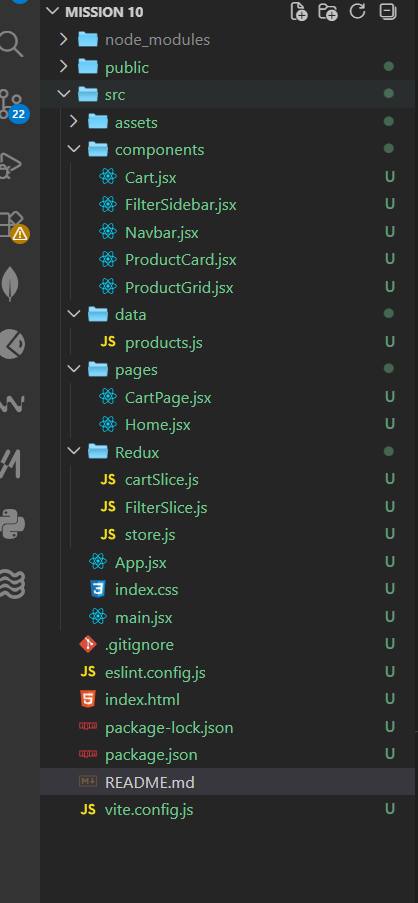
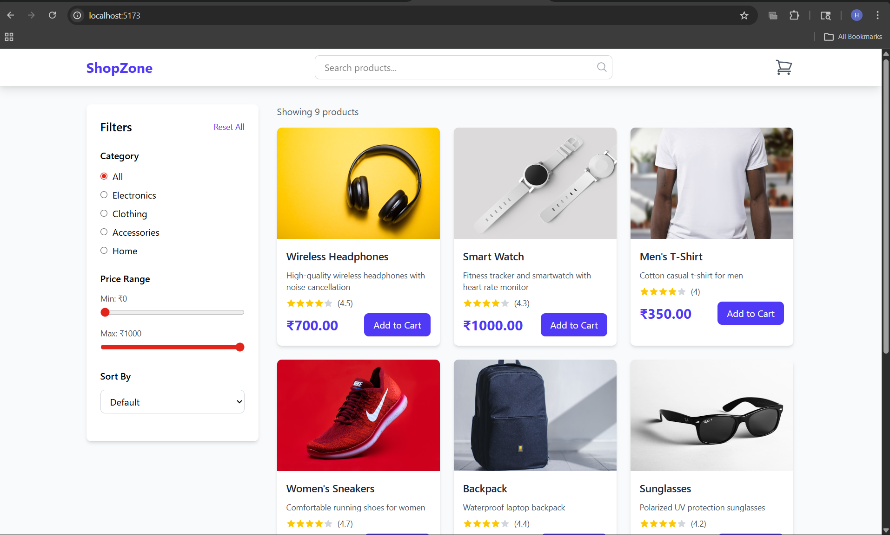

# 🛒 E-Commerce Upgrade (Redux Toolkit)

##  Project Overview

This project is an upgraded version of a React-based e-commerce application using **Redux Toolkit** for advanced state management. It demonstrates how to replace prop drilling and Context API with a scalable global state solution.

---

##  Features

###  Level 1 (Beginner)

* Global state management using **Redux Toolkit**
* Add items to cart
* Remove items from cart
* Centralized store configuration

###  Level 2 (Intermediate)

* Product filtering (Category & Price Range)
* Global filter state using Redux
* Dynamic product rendering based on filters

---

##  Why This Project?

As applications grow, managing state using `useState` and prop drilling becomes complex. Redux Toolkit provides a clean and scalable way to manage global state, making it ideal for real-world applications.

---

##  Tech Stack

* React.js
* Redux Toolkit
* React-Redux
* JavaScript (ES6+)
* Tailwind CSS (optional for UI)

---

##  Project Structure




## ⚙️ Installation & Setup

1. Clone the repository:

```bash
git clone <your-repo-url>
cd project-folder
```

2. Install dependencies:

```bash
npm install
```

3. Install Redux Toolkit:

```bash
npm install @reduxjs/toolkit react-redux
```

4. Run the app:

```bash
npm run dev
```

---

##  Redux Store Setup

* `cartSlice`: Handles cart operations (add/remove items)
* `filterSlice`: Manages filter state (category, price range)
* `store.js`: Combines reducers into a global store

---

##  Cart Functionality

* Add products to cart
* Increase quantity if item already exists
* Remove items from cart

---

##  Filtering Functionality

* Filter by category
* Filter by price range
* Real-time UI updates based on global state

---

##  Key Concepts Covered

* Redux Toolkit (`createSlice`, `configureStore`)
* Global state management
* Avoiding prop drilling
* Derived state (filtered products)
* Clean folder architecture

---

##  Future Improvements

* Persist cart using local storage (Redux Persist)
* Add API integration using `createAsyncThunk`
* Implement authentication (JWT)
* Add search with debounce
* Improve UI/UX

---

## 📷 Screenshots



---


